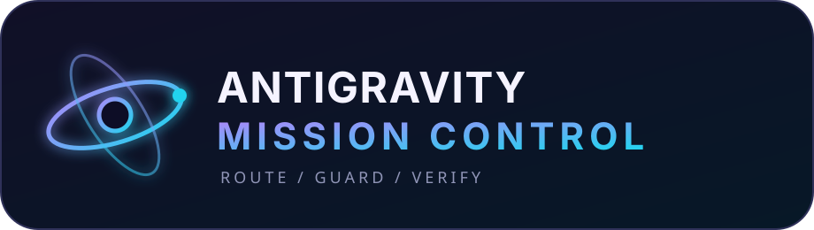
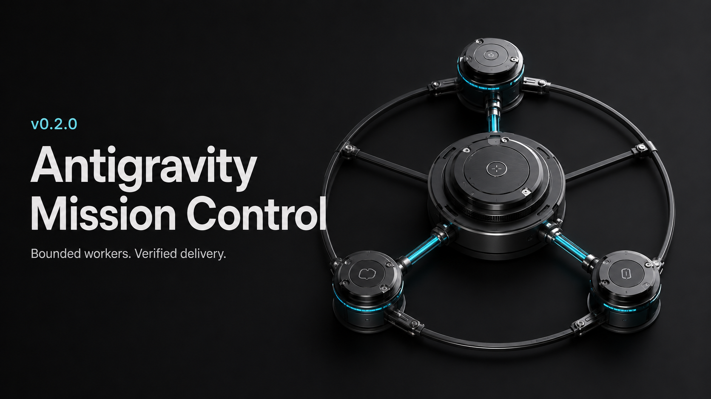
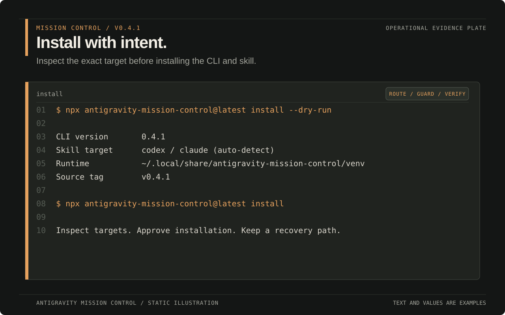
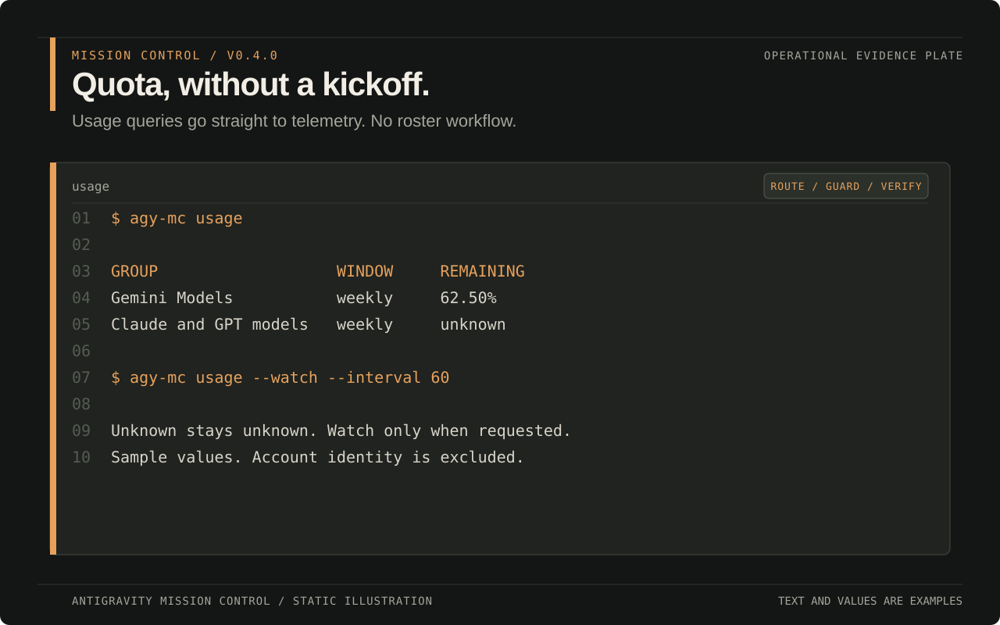
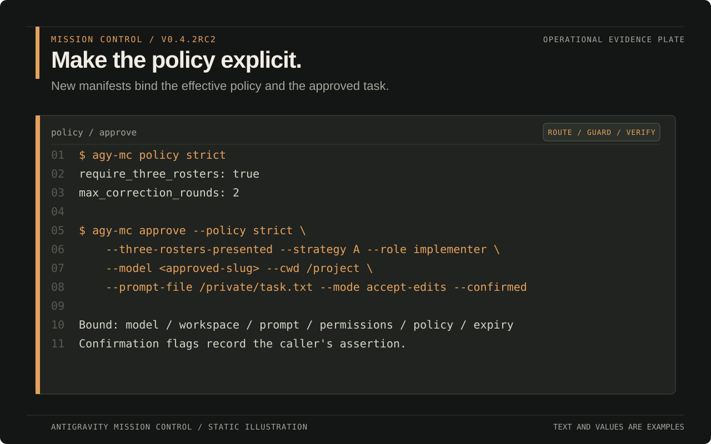
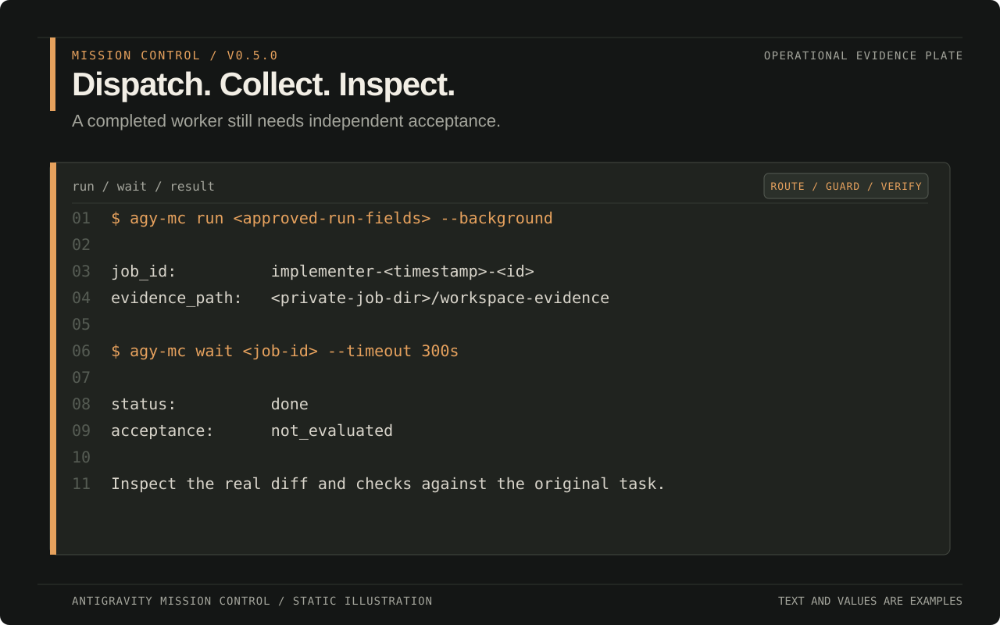
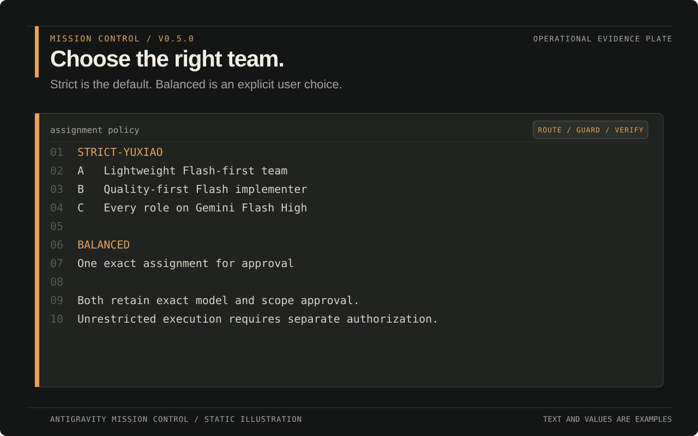
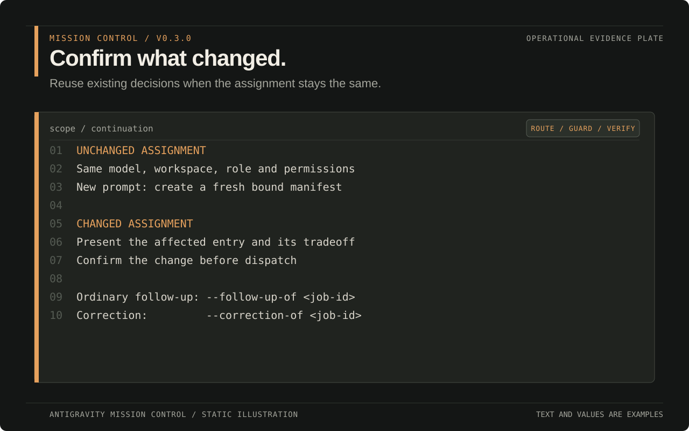
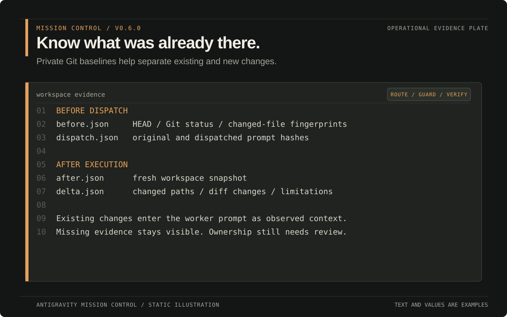
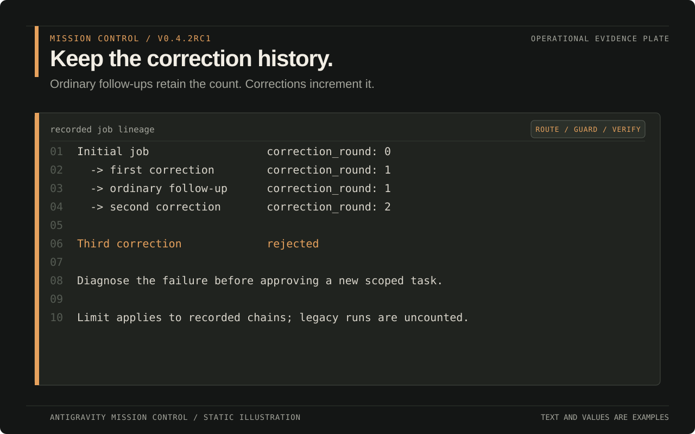

<p align="center"></p>

<p align="center"><a href="README.md">English</a> · <a href="README.zh-CN.md">简体中文</a></p>

<p align="center">
  
  
  
  <a href="LICENSE"></a>
</p>

Policy-aware orchestration for the Antigravity CLI (`agy`): route work to exact models, bind approvals to the task, serialize editing workers, verify cancellation, and watch live quota. Codex remains responsible for acceptance.

<p align="center"></p>

> **v0.2:** policy-aware orchestration with independently reviewed worker output; permission limits are documented below. Independent community project; not affiliated with Google or Antigravity.

## Hand this page to your agent

Paste the block below into Codex or another coding agent. GitHub adds a copy button to the code block.

```text
Open and read https://github.com/YuxiaoMa66/antigravity-mission-control before making changes.

1. Check whether `agy` is installed and signed in.
2. Show me the exact commands and target paths, then wait for my confirmation.
3. If AGY is ready, install v0.2.0 from the Git tag using the command below. If AGY is missing, explain the official `--install-agy` option and ask for separate approval before using it.
4. Run `agy-mc doctor` and report the installed versions and paths.
5. Before delegating project work, show me the A/B/C roster choices with exact available model slugs and wait for my selection.

Treat workspace trust and unrestricted permissions as separate actions. Do not grant either one without my approval.
```

The agent reads the same installation and security boundaries you see on this page, performs the checks, and reports the result. You do not need to translate the README into a chain of shell commands.

## See the flight deck

These v0.2.0 illustrations show command excerpts and workflow summaries. Paths, IDs and quota values are examples, not live screenshots.

<table>
  <tr>
    <td width="50%"><br><sub><strong>Guided install.</strong> Exact targets and dependencies are shown before anything changes.</sub></td>
    <td width="50%"><br><sub><strong>Live quota.</strong> Watch model groups, windows, remaining quota and reset state.</sub></td>
  </tr>
  <tr>
    <td width="50%"><br><sub><strong>Bound approval.</strong> Model, role, workspace, prompt and expiry travel together.</sub></td>
    <td width="50%"><br><sub><strong>Background control.</strong> Dispatch, inspect and collect durable jobs without confusing worker output with acceptance.</sub></td>
  </tr>
  <tr>
    <td width="50%"><br><sub><strong>Roster selection.</strong> Compare complete roles, exact models and access before any worker starts.</sub></td>
    <td width="50%"><br><sub><strong>Change confirmation.</strong> See the approved value, proposal, reason and review impact before accepting a change.</sub></td>
  </tr>
  <tr>
    <td width="50%"><br><sub><strong>Workspace evidence.</strong> Git baselines, changed-file fingerprints and explicit limitations.</sub></td>
    <td width="50%"><br><sub><strong>Correction history.</strong> Follow-ups retain the count; a third correction is rejected.</sub></td>
  </tr>
</table>

## Put the quota you already have to work

If your account includes a Google One AI plan or an eligible student offer, you may already have a year of Gemini access. That quota can sit idle while Antigravity's desktop client breaks your rhythm and its CLI never quite becomes home. Codex has become muscle memory, but its allowance can vanish before lunch and a slow turn may take the scenic route. Gemini Flash brings the speed you wanted to use.

Install Mission Control in the Codex harness you already know. Let Codex act as product manager, supervising editor, and suspicious acceptance reviewer. Give the implementation tickets to Antigravity. Codex defines scope, approves authority, inspects diffs, and runs the checks; AGY workers do the typing.

Bring your own eligible Google account and quota. Mission Control neither creates a subscription nor increases provider limits.

### The control loop keeps the work on course

| Stage | Who owns it | Guardrail |
|---|---|---|
| Structure | Codex | Converts the request into scope, constraints, acceptance criteria, and bounded roles |
| Choices | Codex + you | Offers A/B/C model rosters and meaningful design alternatives; you select or revise the consequential choices |
| Execution | AGY workers | Plans and implements inside the approved objective without asking for permission on every harmless step |
| Supervision | Reviewer + Codex | Checks drift, evidence, tests, and delivery quality; Codex accepts, corrects, or rejects the result |

The planner can choose its own route inside the approved objective. It surfaces alternatives when a choice changes scope, cost, reversibility, or product behavior. The reviewer receives the original brief and the real artifacts, so it can catch a polished answer that solved the wrong problem.

### What A, B and C mean

Mission Control discovers the current AGY model catalog before proposing a roster. Each proposal names the executor, exact model slug, role, filesystem scope and execution profile. You choose one before dispatch.

| Strategy | Team design | Best fit | Tradeoff |
|---|---|---|---|
| A: Recommended | Uses the smallest adequate team. Efficient models handle implementation; Codex keeps planning or review work when another AGY call adds little value. | Routine development, bounded changes and quota-aware work | Best quality/cost balance, with fewer independent model passes |
| B: Best result | Uses the strongest suitable planner and implementer, then prefers a reviewer from another model family. | Ambiguous design, large changes, security-sensitive work and costly mistakes | More quota and time in exchange for deeper planning and independent checking |
| C: Gemini Flash High | Routes every AGY role to the newest available exact slug matching `gemini-.*flash-high`. Separate conversations and adversarial prompts provide review separation. | Fast iteration, consistent Gemini behavior and users who want to spend Gemini quota | Fast and consistent, but reviewer diversity comes from process because all AGY calls stay in one model family |

These strategies are routing rules, not permanent model lists or benchmark rankings. Mission Control reads `agy-mc models` at run time and pins the exact slug you approve. A changed model, role, write scope or permission profile requires confirmation again. Gemini medium and low variants also require a separate exception; the default Gemini route uses High.

The installed Skill uses the same field order shown in the roster selection and change-confirmation images above. A roster proposal ends with an explicit A/B/C choice. A modification pauses the affected entry and shows the approved value, proposed value, reason, scope impact and review-independence impact before asking again.

## Install

Already have AGY? Verify it, launch it once to finish Google sign-in, then install Mission Control:

```bash
agy --version
agy
npx --package='git+https://github.com/YuxiaoMa66/antigravity-mission-control.git#v0.2.0' antigravity-mission-control install
```

No AGY yet? The installer can fetch Google's official installer first:

```bash
npx --package='git+https://github.com/YuxiaoMa66/antigravity-mission-control.git#v0.2.0' antigravity-mission-control install --install-agy
```

Interactive installation asks before adding AGY when it is missing. Non-interactive installation requires the explicit `--install-agy` flag. After a fresh AGY install, run `agy` to complete Google sign-in. Mission Control never reads or copies that login state.

The bootstrapper shows every target before writing, creates a private managed Python environment, installs `agy-mc`, deploys the Codex Skill, and runs without shell interpolation. For CI or agents, add `--yes`; inspect first with `--dry-run`.

```bash
npx --package='git+https://github.com/YuxiaoMa66/antigravity-mission-control.git#v0.2.0' antigravity-mission-control install --dry-run
npx --package='git+https://github.com/YuxiaoMa66/antigravity-mission-control.git#v0.2.0' antigravity-mission-control install --yes
npx --package='git+https://github.com/YuxiaoMa66/antigravity-mission-control.git#v0.2.0' antigravity-mission-control status
```

Direct Python installation is also supported:

```bash
python3 -m pip install "git+https://github.com/YuxiaoMa66/antigravity-mission-control.git@v0.2.0"
agy-mc skill install
agy-mc doctor
```

Full setup, upgrade, uninstall, local-source and PATH notes: [Installation guide](docs/INSTALL.md).

## What Mission Control adds

| Layer | Responsibility |
|---|---|
| Codex Skill | Roster choice, scope, permission boundaries, independent acceptance |
| `agy-mc` core | Model discovery, signed approvals, AGY transport, jobs, locks, evidence, quota |
| npm bootstrap | Managed Python environment, Skill deployment, update and recoverable uninstall |
| AGY | Executes the exact bounded worker assignment |

The npm layer is deliberately thin. The Python companion is the single behavioral implementation, so npm and direct Python installs cannot drift into different orchestration rules.

## Live quota

```bash
agy-mc usage
agy-mc usage --watch --interval 60
agy-mc usage --format json
```

The normalized `agy-mc-usage.v1` output includes model groups, quota windows, remaining percentage, reset time and disabled state. Missing data stays `unknown`; it is never rewritten as `0%`. Raw provider payloads, OAuth material and account identity are excluded.

## Bound approvals

After the user approves the exact roster and permission profile, create a short-lived manifest:

```bash
agy-mc approve \
  --policy strict --three-rosters-presented \
  --strategy A --role implementer --model gemini-3.7-flash-high \
  --cwd /absolute/project --prompt-file /private/prompt.txt \
  --mode accept-edits --expires-minutes 60 --confirmed
```

Pass the returned file to `run`. The machine-local HMAC binds strategy, role, model, canonical workspace, prompt hash, mode, permission profile, conversation and expiration. Changing any bound field invalidates the run.

```bash
agy-mc run \
  --strategy A --role implementer --model gemini-3.7-flash-high \
  --cwd /absolute/project --prompt-file /private/prompt.txt \
  --mode accept-edits --approval-file ~/.local/state/antigravity-mission-control/approvals/<id>.json
```

Legacy boolean approval flags remain for migration from earlier releases and are deprecated.

## Background jobs

Add `--background`, then use:

```bash
agy-mc status [job-id]
agy-mc wait <job-id> --timeout 10m
agy-mc result <job-id>
agy-mc cancel <job-id>
agy-mc continue <job-id> --prompt-file /private/follow-up.txt
```

Editing jobs use an OS-level non-blocking lock per canonical workspace. `cancel` records `canceling`, waits after TERM, escalates to KILL if required, and reports `canceled` only after process exit is confirmed.

## Design principles

- Exact models are discovered from the current AGY session; no remembered slug is treated as truth.
- Workspace trust and unrestricted execution are separate user-approved mutations.
- Worker success is not task acceptance. Codex checks the real diff, diagnostics and tests.
- Prompts travel over `stream-json` stdin, never in process arguments.
- State directories are `0700`; prompts, manifests, locks and results are `0600`.
- Installation and uninstall preserve recoverable backups.

See [Reference](docs/REFERENCE.md), [Security](SECURITY.md), [Contributing](CONTRIBUTING.md), and [Release process](docs/RELEASING.md).

## Validate

```bash
python3 -m unittest discover -s tests -v
npm test
npm pack --dry-run
python3 -m compileall -q antigravity_mission_control scripts tests
```

## License

MIT. Role-contract patterns were adapted from [keli-wen/agy-staff](https://github.com/keli-wen/agy-staff) under its MIT license; see [NOTICE](NOTICE).
