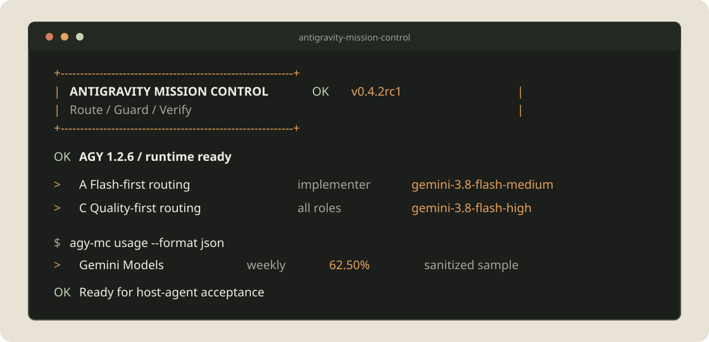

<p align="center"></p>

<p align="center"><a href="README.md">English</a> · <a href="README.zh-CN.md">简体中文</a></p>

<p align="center">
  
  
  
  <a href="LICENSE"></a>
</p>

面向 Antigravity CLI（`agy`）的策略化任务控制层：将工作路由到精确模型，把批准绑定到具体任务，串行保护编辑 worker，确认取消结果并实时查看额度；最终验收始终由 Codex 负责。

<p align="center"></p>

> **Alpha：** 已适合公开预发布测试，但还不是稳定安全边界。本项目为独立社区项目，与 Google 或 Antigravity 无官方隶属关系。

## 安装

先安装 AGY，并确认 `agy --version` 可用。然后运行 npm 一键安装器：

```bash
npx antigravity-mission-control install
```

安装器会先展示所有目标，再创建私有 Python 运行环境、安装 `agy-mc`、部署 Codex Skill。全程使用参数数组，不使用 shell 拼接。CI 或 agent 环境需要加 `--yes`；可以先用 `--dry-run` 查看影响。

```bash
npx antigravity-mission-control install --dry-run --lang zh
npx antigravity-mission-control install --yes --lang zh
npx antigravity-mission-control status --lang zh
```

也支持直接使用 Python：

```bash
python3 -m pip install "git+https://github.com/YuxiaoMa66/antigravity-mission-control.git@v0.1.0a1"
agy-mc skill install --lang zh
agy-mc doctor
```

完整安装、更新、卸载、本地来源和 PATH 说明见[安装指南](docs/INSTALL.zh-CN.md)。

## 分层结构

| 层 | 职责 |
|---|---|
| Codex Skill | 阵容选择、范围、权限边界和独立验收 |
| `agy-mc` 核心 | 模型发现、签名批准、AGY 传输、任务、锁、证据和额度 |
| npm bootstrap | 托管 Python 环境、Skill 部署、更新与可恢复卸载 |
| AGY | 执行精确且有边界的 worker 任务 |

npm 层刻意保持轻量。全部行为规则只在 Python companion 中实现，避免 npm 与 Python 安装方式产生两套逻辑。

## 实时额度

```bash
agy-mc usage
agy-mc usage --watch --interval 60
agy-mc usage --format json
```

规范化的 `agy-mc-usage.v1` 会显示模型组、额度窗口、剩余百分比、重置时间和禁用状态。缺失值保持 `unknown`，绝不会改写成误导性的 `0%`；输出不包含 OAuth、原始账户载荷或账户身份。

## 绑定批准

用户确认精确阵容和权限后，生成短期有效的批准清单：

```bash
agy-mc approve \
  --strategy A --role implementer --model gemini-3.7-flash-high \
  --cwd /absolute/project --prompt-file /private/prompt.txt \
  --mode accept-edits --expires-minutes 60 --confirmed
```

将返回的文件传给 `run`。本机 HMAC 会绑定策略、角色、模型、规范工作区、prompt 哈希、模式、权限配置、会话和过期时间；任何字段变化都会拒绝执行。

```bash
agy-mc run \
  --strategy A --role implementer --model gemini-3.7-flash-high \
  --cwd /absolute/project --prompt-file /private/prompt.txt \
  --mode accept-edits --approval-file ~/.local/state/antigravity-mission-control/approvals/<id>.json
```

旧的布尔批准参数仅用于 Alpha 迁移兼容，已经弃用。

## 后台任务

运行时增加 `--background`，然后使用：

```bash
agy-mc status [job-id]
agy-mc wait <job-id> --timeout 10m
agy-mc result <job-id>
agy-mc cancel <job-id>
agy-mc continue <job-id> --prompt-file /private/follow-up.txt
```

编辑任务按规范工作区使用操作系统级非阻塞锁。`cancel` 会先写入 `canceling`，发送 TERM 并等待，必要时升级到 KILL；只有确认进程退出后才报告 `canceled`。

## 核心原则

- 每次从当前 AGY 会话发现精确模型，不把历史 slug 当成事实。
- 工作区信任与 unrestricted 执行是两项独立授权。
- worker 成功不等于任务通过；Codex 必须检查真实 diff、诊断和测试。
- prompt 通过 `stream-json` stdin 发送，不进入进程参数。
- 状态目录权限为 `0700`，prompt、批准、锁和结果为 `0600`。
- 安装、更新和卸载均保留可恢复备份。

继续阅读：[完整参考](docs/REFERENCE.zh-CN.md)、[安全说明](SECURITY.md)、[贡献指南](CONTRIBUTING.md)和[发布流程](docs/RELEASING.zh-CN.md)。

## 验证

```bash
python3 -m unittest discover -s tests -v
npm test
npm pack --dry-run
python3 -m compileall -q antigravity_mission_control scripts tests
```

## 许可证

MIT。角色合同模式基于 MIT 许可参考了 [keli-wen/agy-staff](https://github.com/keli-wen/agy-staff)，详见 [NOTICE](NOTICE)。
