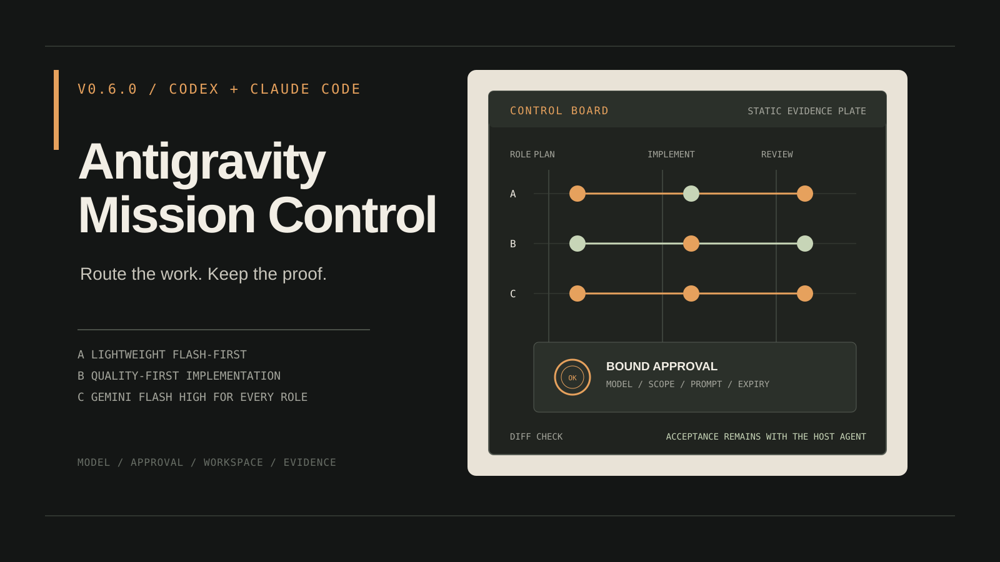

<p align="center"></p>

<p align="center"><a href="README.md">English</a> · <a href="README.zh-CN.md">简体中文</a></p>

<p align="center">
  
  
  
  <a href="LICENSE"></a>
</p>

面向 Antigravity CLI（`agy`）的策略化任务控制层：将工作路由到精确模型，把批准绑定到具体任务，串行保护编辑 worker，确认取消结果并实时查看额度；最终验收始终由你的 coding agent（Codex 或 Claude Code）负责。

<p align="center"></p>

> **v0.6.0：** 稳定版带来更易用的任务管理：`agy-mc status` 支持 `--limit` 与可重复的 `--state`，`agy-mc prune --older-than` 可清理已完成的旧任务。`agy-mc wait --timeout` 现在也支持 `d`（天）。任务状态字段异常时不会再让 `status`、`wait`、`cancel` 或 `prune` 崩溃。运行时路由行为保持 v0.3.0 的 Flash 优先设计。
>
> 本项目为独立社区项目，与 Google 或 Antigravity 无官方隶属关系。

## 直接把本页交给 Agent 安装

把下面整段复制给 Codex、Claude Code 或其他 coding agent。GitHub 代码块右上角自带复制按钮。

```text
开始修改前，请先打开并阅读 https://github.com/YuxiaoMa66/antigravity-mission-control 。

1. 检查 `agy` 是否已经安装并完成登录。
2. 向我展示将执行的精确命令和目标路径，等我确认后再继续。
3. 如果 AGY 已经可用，使用 `npx antigravity-mission-control@latest install` 安装稳定版；需要固定版本时使用 `@0.6.0`。如果没有 AGY，先解释官方 `--install-agy` 方案，并为安装 AGY 单独征得我的同意。
4. 运行 `agy-mc doctor`，然后报告安装版本和路径。
5. 开始委派项目任务前，使用当前可用的精确模型 slug 向我展示 A/B/C 三套阵容，等我选择后再执行。

把 workspace trust 和 unrestricted 权限当作两项独立操作。没有我的批准，不要增加其中任何一项。

保留你（宿主 agent）的最终验收权；AGY worker 只能在已批准范围内执行。
```

Agent 会阅读本页的安装步骤和安全边界，完成检查后回报结果。你不需要自己把 README 翻译成一串终端命令。

## 看看实际操作界面

以下为 v0.6.0 命令摘录与流程示意图。路径、任务 ID 和额度均为示例，并非实时运行截图。

<table>
  <tr>
    <td width="50%"><br><sub><strong>引导安装。</strong> 修改前先展示精确目标、运行环境和依赖。</sub></td>
    <td width="50%"><br><sub><strong>实时额度。</strong> 持续查看模型组、额度窗口、剩余比例和重置状态。</sub></td>
  </tr>
  <tr>
    <td width="50%"><br><sub><strong>绑定批准。</strong> 模型、角色、工作区、prompt 和有效期一起绑定。</sub></td>
    <td width="50%"><br><sub><strong>后台控制。</strong> 调度、检查和收集持久任务，同时保持 worker 输出与最终验收分离。</sub></td>
  </tr>
  <tr>
    <td width="50%"><br><sub><strong>阵容选择。</strong> worker 启动前比较完整角色、精确模型和权限。</sub></td>
    <td width="50%"><br><sub><strong>修改确认。</strong> 接受修改前查看已批准值、拟修改值、原因和审核影响。</sub></td>
  </tr>
  <tr>
    <td width="50%"><br><sub><strong>工作区证据。</strong> Git 前后基线、变更文件指纹及明确的证据限制。</sub></td>
    <td width="50%"><br><sub><strong>纠错记录。</strong> 普通追问保留计数，记录链中的第三次纠错被拒绝。</sub></td>
  </tr>
</table>

## 别让已经薅到的 Gemini 在账号里吃灰

如果你手里正好有 Google One AI 订阅，或者拿到了符合条件的学生一年福利，账号里可能已经躺着一批 Gemini 额度。Antigravity 客户端像写到一半换键盘，CLI 也未必顺手；你的 coding agent 倒是已经用出肌肉记忆，可额度常常午饭前就见底，模型偶尔还爱走观光路线。Gemini Flash 跑得快，这份速度值得派上用场。

把 Mission Control 装进你熟悉的 harness，Codex 或 Claude Code 都行。让它当产品经理、总监和爱挑刺的验收官，把实现工单交给 Antigravity。宿主 agent 定范围、批权限、看 diff、跑测试；AGY worker 负责干活。

Google 账号资格和额度由你自己提供。Mission Control 不送订阅，也不会把提供商额度凭空变多。

### 用结构和审核把任务拉回正轨

| 阶段 | 谁负责 | 防偏离设计 |
|---|---|---|
| 结构设计 | 宿主 agent | 把需求整理成范围、约束、验收标准和有边界的角色 |
| 方案选择 | 宿主 agent + 你 | 提供 A/B/C 模型阵容和有实际差异的设计选项；关键选择由你确认或修改 |
| 执行 | AGY worker | 在已批准目标内自己制定步骤并完成工作，不为每个无害动作反复请示 |
| 监督验收 | reviewer + 宿主 agent | 检查范围漂移、证据、测试和交付质量；宿主 agent 决定接受、纠正或退回 |

planner 可以在批准目标内自己决定路线。某个选择会改变范围、成本、可逆性或产品行为时，它必须把可选方案摆出来。reviewer 会同时拿到原始任务书和真实产物，专门识别“答案写得很漂亮，完成的却是另一件事”。

### A、B、C 三套方案有什么区别

Mission Control 会先读取当前 AGY 模型目录，再提出阵容。每套方案都要列出执行者、精确模型 slug、角色、文件权限范围和执行模式，由你在 dispatch 前选择。

| 方案 | 阵容设计 | 适合场景 | 取舍 |
|---|---|---|---|
| A：轻量 Flash 优先 | 使用能够完成任务的最小团队，按角色风险优先选择合适强度的 Gemini Flash。 | 日常开发、边界明确的修改和需要节省额度的任务 | 成本和延迟较低，独立模型复核次数较少 |
| B：质量优先，implementer 用 Flash | 保持较强的规划和审核，但 implementer 优先使用 Gemini Flash。 | 设计模糊、大范围修改、安全敏感任务和返工代价高的项目 | 使用更多额度和时间，换取更深入的规划与独立检查 |
| C：质量优先，全部 Gemini Flash High | 沿用 B 的质量目标，但所有 AGY 角色都使用当前最新的 `gemini-.*flash-high` 精确 slug。 | 需要质量和速度，同时希望统一使用 Gemini 的任务 | 所有 AGY 调用属于同一模型家族，审核独立性主要依靠独立会话、对抗提示和宿主验收 |

这三套方案是动态路由规则，不是永久模型名单，也不是模型排行榜。Mission Control 在运行时读取 `agy-mc models`，并固定你批准的精确 slug。A、B 可以为低强度任务提出 Gemini Flash medium 或 low；实际批准仍需要单独确认非 High Gemini。C 始终使用 High。模型、角色、写入范围或权限配置发生变化时，需要重新确认。

安装后的 Skill 会按照上面“阵容选择”和“修改确认”图片中的相同字段顺序输出。阵容提案最后要求明确选择 A/B/C；修改时暂停受影响的条目，列出已批准值、拟修改值、原因、范围影响和审核独立性影响，然后重新请求确认。

## 安装

已经有 AGY：先确认版本，运行一次 `agy` 完成 Google 登录，再安装 Mission Control：

```bash
agy --version
agy
npx antigravity-mission-control@latest install --lang zh
```

还没有 AGY：让安装器先调用 Google 官方安装器：

```bash
npx antigravity-mission-control@latest install --install-agy --lang zh
```

交互安装检测不到 AGY 时会先询问；非交互安装必须明确增加 `--install-agy`。新装 AGY 后运行 `agy` 完成 Google 登录。Mission Control 不读取、不复制登录材料。

安装器会先展示所有目标，再创建私有 Python 运行环境、安装 `agy-mc`、把 Skill 部署到 Codex 和/或 Claude Code（自动检测，也可用 `--host` 指定）。全程使用参数数组，不使用 shell 拼接。CI 或 agent 环境需要加 `--yes`；可以先用 `--dry-run` 查看影响。

```bash
npx antigravity-mission-control@latest install --dry-run --lang zh
npx antigravity-mission-control@latest install --yes --lang zh
npx antigravity-mission-control@latest status --lang zh
```

也支持直接使用 Python：

```bash
python3 -m pip install "git+https://github.com/YuxiaoMa66/antigravity-mission-control.git@v0.6.0"
agy-mc skill install --lang zh
agy-mc doctor
```

完整安装、更新、卸载、本地来源和 PATH 说明见[安装指南](docs/INSTALL.zh-CN.md)。

## 分层结构

| 层 | 职责 |
|---|---|
| 宿主 Skill（Codex / Claude Code） | 阵容选择、范围、权限边界和独立验收 |
| `agy-mc` 核心 | 模型发现、签名批准、AGY 传输、任务、锁、证据和额度 |
| npm bootstrap | 托管 Python 环境、Skill 部署、更新与可恢复卸载 |
| AGY | 执行精确且有边界的 worker 任务 |

npm 层刻意保持轻量。全部行为规则只在 Python companion 中实现，避免 npm 与 Python 安装方式产生两套逻辑。

## 实时额度

```bash
agy-mc usage
agy-mc usage --watch --interval 60
agy-mc usage --format json
```

规范化的 `agy-mc-usage.v1` 会显示模型组、额度窗口、剩余百分比、重置时间和禁用状态。缺失值保持 `unknown`，绝不会改写成误导性的 `0%`；输出不包含 OAuth、原始账户载荷或账户身份。

## 绑定批准

用户确认精确阵容和权限后，生成短期有效的批准清单：

```bash
agy-mc approve \
  --policy strict --three-rosters-presented \
  --strategy A --role implementer --model gemini-3.8-flash-medium \
  --cwd /absolute/project --prompt-file /private/prompt.txt \
  --mode accept-edits --expires-minutes 60 \
  --non-high-gemini-confirmed --confirmed
```

将返回的文件传给 `run`。本机 HMAC 会绑定策略、角色、模型、规范工作区、prompt 哈希、模式、权限配置、会话和过期时间；任何字段变化都会拒绝执行。

```bash
agy-mc run \
  --strategy A --role implementer --model gemini-3.8-flash-medium \
  --cwd /absolute/project --prompt-file /private/prompt.txt \
  --mode accept-edits --approval-file ~/.local/state/antigravity-mission-control/approvals/<id>.json
```

旧的布尔批准参数仅用于旧版迁移兼容，已经弃用。

## 后台任务

运行时增加 `--background`，然后使用：

```bash
agy-mc status [job-id]
agy-mc status --limit 20 --state running --state canceling
agy-mc wait <job-id> --timeout 10m
agy-mc result <job-id>
agy-mc cancel <job-id>
agy-mc continue <job-id> --prompt-file /private/follow-up.txt
agy-mc prune --older-than 7d
agy-mc prune --older-than 7d --yes
```

编辑任务按规范工作区使用操作系统级非阻塞锁。`cancel` 会先写入 `canceling`，发送 TERM 并等待，必要时升级到 KILL；只有确认进程退出后才报告 `canceled`。

不带 `job-id` 列出全部任务时支持 `--limit N`（最近启动的 N 个任务）和 `--state`（可重复，只保留指定状态）。

`prune --older-than DURATION`（单位 `ms`/`s`/`m`/`h`/`d`，例如 `12h` 或 `7d`）会删除已结束（`done`、`done_with_warnings`、`error`、`crashed`、`cancel_failed`、`canceled`）且 `finished_at` 早于截止时间的任务。未结束的任务、有存活 pid 的任务，以及状态或 `finished_at` 未知或缺失的任务都会被保留。不加 `--yes` 时是 dry run，只报告会删除什么。

## 核心原则

- 每次从当前 AGY 会话发现精确模型，不把历史 slug 当成事实。
- 工作区信任与 unrestricted 执行是两项独立授权。
- worker 成功不等于任务通过；宿主 agent 必须检查真实 diff、诊断和测试。
- prompt 通过 `stream-json` stdin 发送，不进入进程参数。
- 状态目录权限为 `0700`，prompt、批准、锁和结果为 `0600`。
- 安装、更新和卸载均保留可恢复备份。

继续阅读：[完整参考](docs/REFERENCE.zh-CN.md)、[安全说明](SECURITY.md)、[贡献指南](CONTRIBUTING.md)和[发布流程](docs/RELEASING.zh-CN.md)。

## 验证

```bash
python3 -m unittest discover -s tests -v
npm test
npm pack --dry-run
python3 -m compileall -q antigravity_mission_control scripts tests
```

## 许可证

MIT。角色合同模式基于 MIT 许可参考了 [keli-wen/agy-staff](https://github.com/keli-wen/agy-staff)，详见 [NOTICE](NOTICE)。
